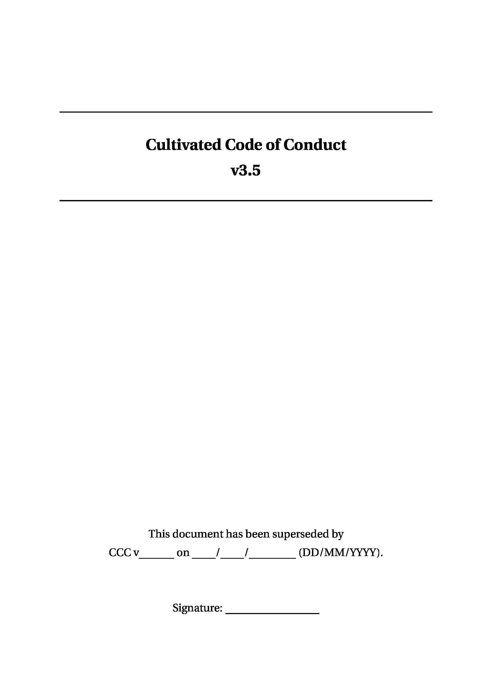
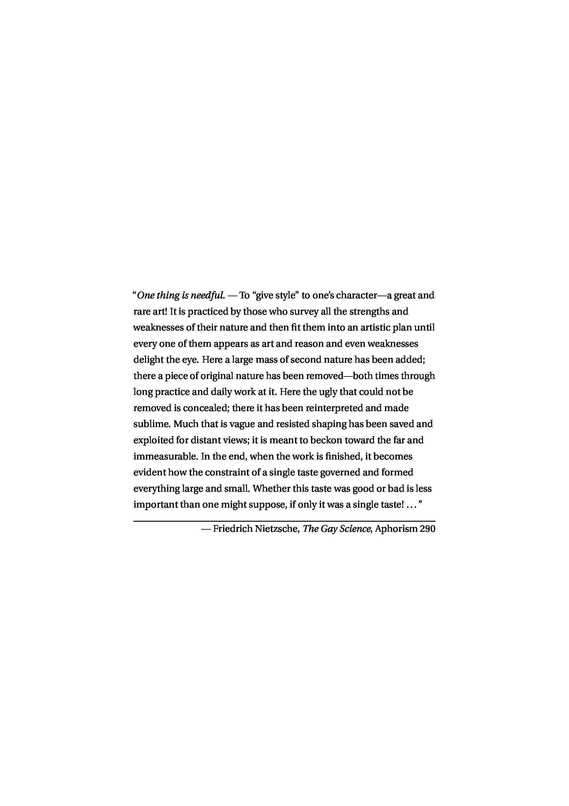
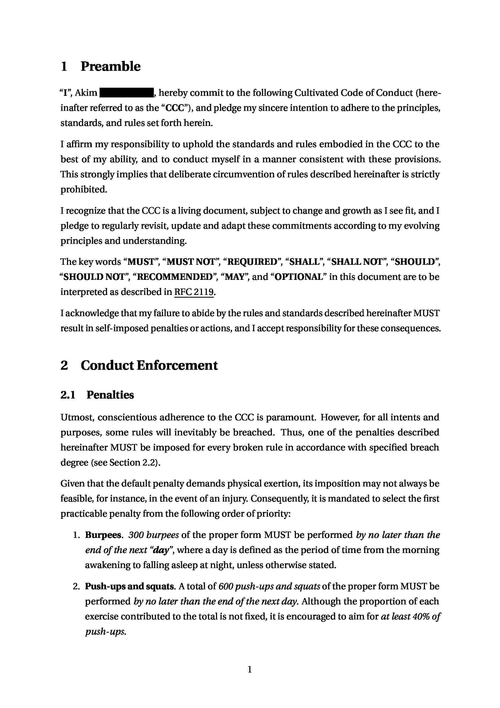
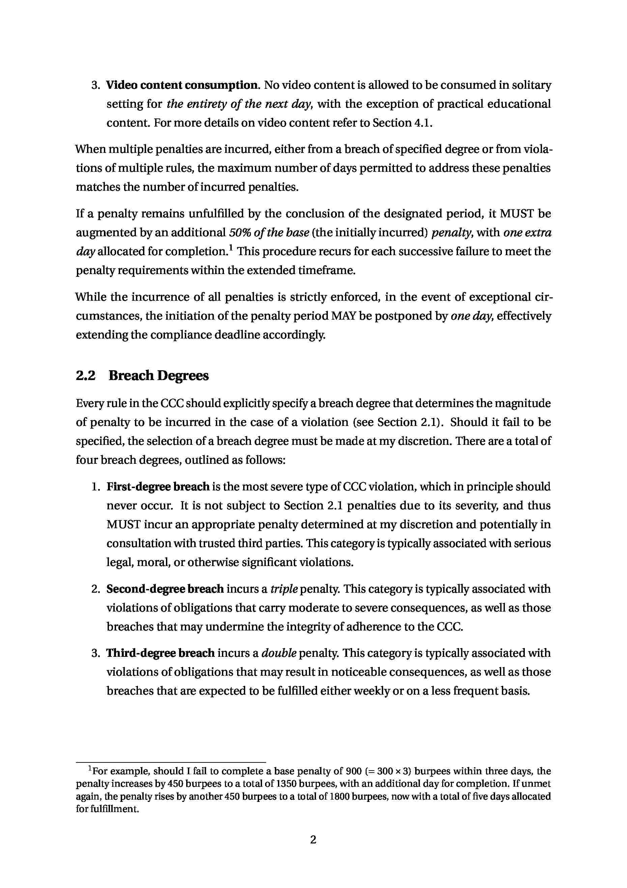
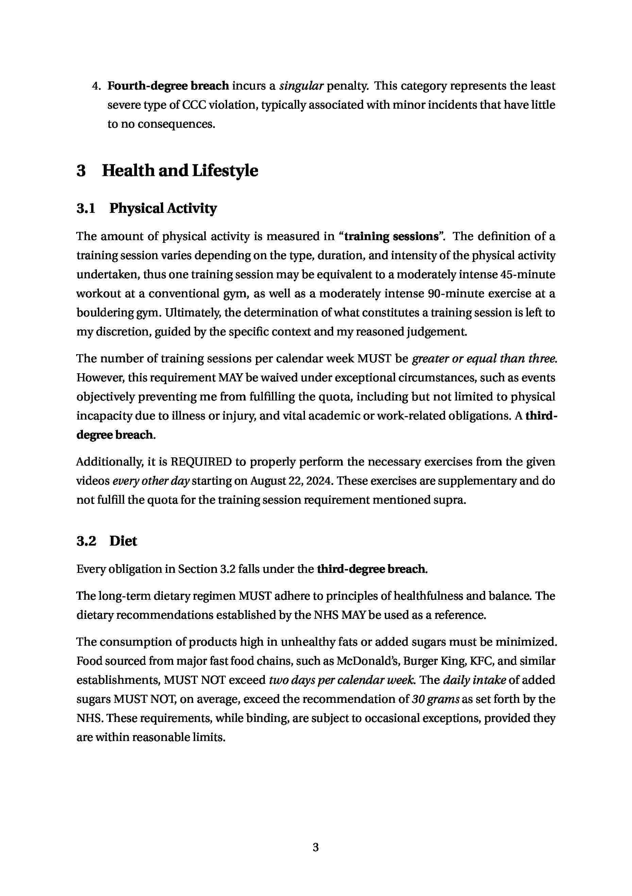
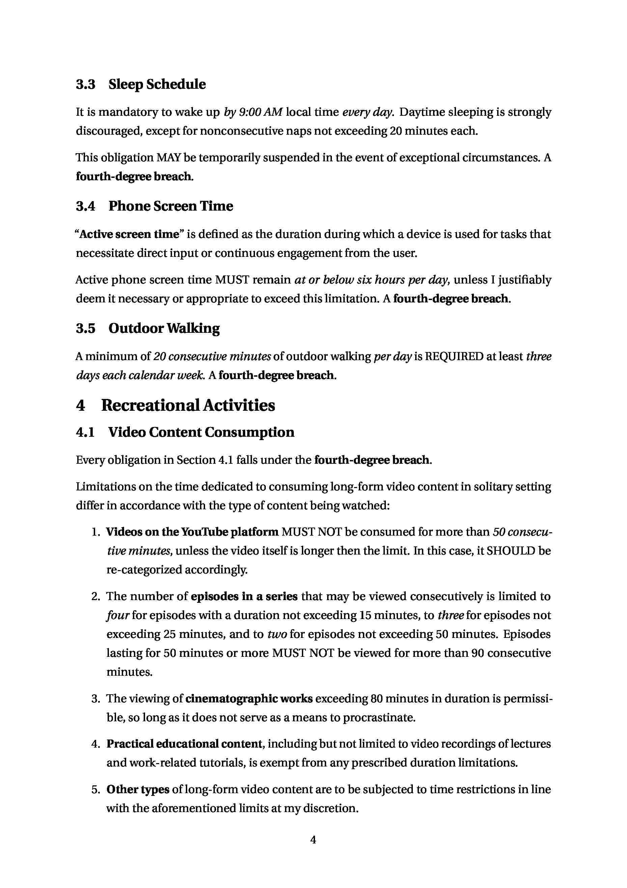

# FAQ [^faq]
[^faq]: These questions have been frequently asked by no one. I am writing this
before even making the CCC public. ¯\\\_(ツ)\_/¯

### What is the CCC?
The CCC, or the Cultivated Code of Conduct, is a document where I clearly
define the rules, principles, behaviours, moral values and other standards I
aim to live by.

### Why?..
At some point or another, we've all experienced
moments where we've failed to keep a promise to ourselves, whether it's to quit
doing something or to do it more often. To prevent this from happening again, I
decided to make such promises binding by writing them down in the "official"
document.

### Why is it "Cultivated"?
As stated in one of the introductory paragraphs:

>[...] the CCC is a living document, subject to change and growth as I see fit, [...]

So the "Cultivated" part emphasizes the fact that this document embodies a set
of standards which have been progressively developed and refined
over time.

### Why use legal style?
The primary reason lies in the precision that a legal style affords; detailed
rules and stringent requirements mitigate the possibility of circumventing the
system. Furthermore, the considerable time and effort required to create such
documents inherently enhance their value, fostering a stronger commitment to
adherence. Also it looks cool.

### Why make it public?

To increase the probability of actually following it. I particularly dislike
hypocrisy; therefore, if other people are aware of the rules I am following,
they can call me out when I don't. I also believe that it could provide others
with a clearer understanding of who I am and what kind of person I aspire to
be. 

However, the fact that this document is available to people beyond my close
friends and relatives, means that I will have to censor out some sensitive parts
which I'd rather not disclose to the entire world.

# Preview
*Click on any image to view the pdf document.*
<!--PREVIEWS START-->

<!--PREVIEWS FINISH-->
